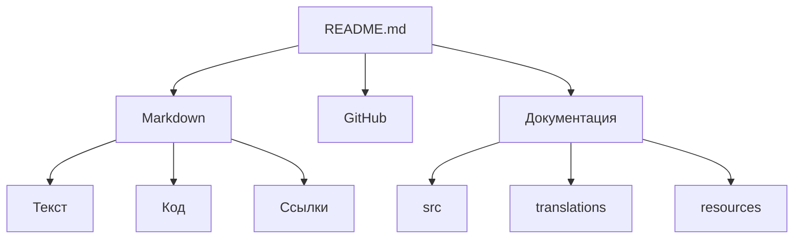

Итог занятия: Markdown и README
`markdown.md`
> Практическая работа по изучению Markdown и оформлению README-файлов.
---
## Навигация по проекту

- [Markdown](#markdown)
- [Заголовки](#заголовки)
- [Форматирование текста](#форматирование-текста)
- [Списки](#списки)
- [Ссылки и изображения](#ссылки-и-изображения)
- [Код](#код)
- [Цитаты](#цитаты)
- [Таблицы](#таблицы)
- [Список задач](#список-задач)
- [Навигация по документу](#навигация-по-документу)
- [Mermaid](#mermaid)
- [Структура проекта](#структура-проекта)
- [Документы проекта](#документы-проекта)

---
Markdown
Markdown — простой язык разметки, который используется для оформления текста, документации и README-файлов.
В ходе занятия были изучены основные возможности Markdown: заголовки, форматирование текста, списки, ссылки, изображения, код, таблицы, цитаты и диаграммы.
> README должен быть не только информативным, но и удобным для чтения.
---
Заголовки
Markdown поддерживает несколько уровней заголовков:
```markdown
# Заголовок 1-го уровня

## Заголовок 2-го уровня

### Заголовок 3-го уровня

#### Заголовок 4-го уровня
```
Пример:
Заголовок 1-го уровня
Заголовок 2-го уровня
Заголовок 3-го уровня
---
Форматирование текста
Markdown позволяет изменять оформление текста.
Жирный
Курсив
Зачеркнутый
<u>Подчеркнутый</u>
Пример исходного кода:
```markdown
**Жирный**

*Курсив*

~~Зачеркнутый~~

<u>Подчеркнутый</u>
```
---
Списки
Ненумерованный список
```markdown
- пункт 1
- пункт 2
- пункт 3
    - пункт 3.1
        - пункт 3.11
```
Результат:
пункт 1
пункт 2
пункт 3
пункт 3.1
пункт 3.11
Также можно использовать `*`:
```markdown
* пункт 1
* пункт 2
* пункт 3
    * пункт 3.1
        * пункт 3.11
```
Нумерованный список
```markdown
1. пункт 1
1. пункт 2
1. пункт 3
    1. вложенный пункт
```
Результат:
пункт 1
пункт 2
пункт 3
вложенный пункт
---
Горизонтальная черта
Для разделения частей документа можно использовать:
```markdown
---
```
или
```markdown
***
```
Пример:
---
Текст после горизонтальной черты.
---
---
Ссылки и изображения
Внутренняя ссылка
```markdown
[Ссылка](/markdown.md)
```
Внешние ссылки
```markdown
[Google](https://google.com)

[GitHub](https://github.com)
```
Изображения
Для вставки изображения используется конструкция:
```markdown

```
Изображение 1

Изображение 2

Изображение 3

---
Код
Строчный код
```markdown
`code`
```
Результат: `code`
Блок кода
```markdown
```
code
```
```
Результат:
```text
code
```
Shell
```shell
echo "Hello, World!"
```
Python
```python
print("Hello, World!")
```
---
Цитаты
Для создания цитаты используется символ `>`:
```markdown
> Важный текст
```
Результат:
> Важный текст
---
Таблицы
Markdown позволяет создавать таблицы:
```markdown
| Заголовок 1 | Заголовок 2 | Заголовок 3 |
|-------------|-------------|-------------|
| Ячейка 1    | Ячейка 2    | Ячейка 3    |
| Ячейка 4    | Ячейка 5    | Ячейка 6    |
```
Результат:
| Заголовок 1 | Заголовок 2 | Заголовок 3 |
|-------------|-------------|-------------|
| Ячейка 1    | Ячейка 2    | Ячейка 3    |
| Ячейка 4    | Ячейка 5    | Ячейка 6    |
---
Список задач
Markdown поддерживает интерактивные чек-листы:
```markdown
- [x] закрытая задача
- [ ] открытая задача
```
Результат:
[x] закрытая задача
[ ] открытая задача
---
## Навигация по документу

Markdown позволяет создавать ссылки на заголовки документа.

- [Windows](#windows)
- [Linux](#linux)
- [macOS](#macos)
- [Docker Desktop](#docker-desktop)

### Windows

Microsoft Windows — семейство операционных систем компании Microsoft с графическим интерфейсом для персональных компьютеров и серверов.

### Linux

Linux — семейство свободных и открытых Unix-подобных операционных систем, основанных на ядре Linux.

### macOS

macOS — операционная система компании Apple, используемая на компьютерах Mac.

### Docker Desktop

Docker Desktop — приложение с графическим интерфейсом, предназначенное для создания, запуска и управления контейнерами Docker.

---

## Mermaid

Mermaid позволяет создавать диаграммы непосредственно внутри Markdown-документов.



---

## Документы проекта

1. [README в папке src](src/README.md)
2. [README в папке translations](translations/README.md)
3. [README в папке resources](resources/README.md)

---

## Структура проекта

```text
test/
├── README.md
├── markdown.md
├── src/
│   └── README.md
├── translations/
│   └── README.md
└── resources/
    └── README.md
```

---

## Итог

В результате занятия были изучены основные возможности Markdown и принципы оформления README-файлов.

Полученные навыки позволяют создавать структурированную документацию с **текстовым форматированием**, *ссылками*, изображениями, таблицами, блоками кода, чек-листами и диаграммами Mermaid.

> Markdown — простой инструмент, с помощью которого можно создавать понятную и удобную документацию для проектов.
Итог
В результате занятия были изучены основные возможности Markdown и принципы оформления README-файлов.
Полученные навыки позволяют создавать структурированную документацию с текстовым форматированием, ссылками, изображениями, таблицами, блоками кода, чек-листами и диаграммами Mermaid.
> Markdown — простой инструмент, с помощью которого можно создавать понятную и удобную документацию для проектов.
