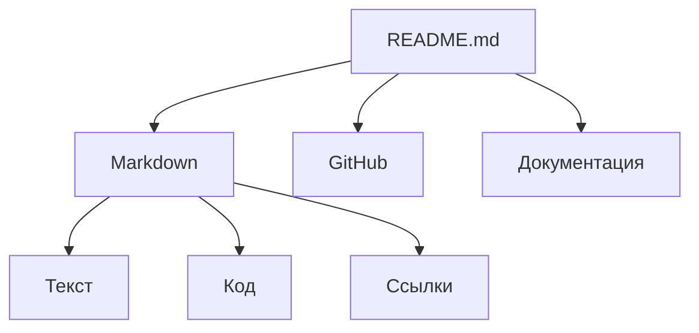

# Примеры форматирования Markdown

`Mardown.md`

Заголовки

# - Заголовок 1-го ур-ня
## - Заголовок 2-го ур-ня
### - Заголовок 3-го ур-ня
etc.

текст

- **Жирный**
- *Курсив*
- ~~Зачеркнутый~~
- <u>Подчеркнутый</u>

---
Списки

Ненумерованный

- пункт 1
- пункт 2
- пункт 3
    - пункт 3.1
        - пункт 3.11


* пункт 1
* пункт 2
* пункт 3
    * пункт 3.1
        * пункт 3.11


Нумерованный список

1. пункт 1
1. пункт 2
1. пункт 3
    1. пункт 3
***
Горизонтальная черта

---
текст
***

Cсылки

Внутренние

[Ссылка](/markdown.md)

Внешние ссылки

[Google](https://google.com)

Изоражения


Код

`code`

``code``

```
code
```
```shell
code
```
```python
helloworld!('print')
```

Цитаты
> Важный Текст

таблица
| Заголовок 1 | Заголовок 2 | Заголовок 3 |
|-------------|-------------|-------------|
| Ячейка 1    | Ячейка 2    | Ячейка 3    |
| Ячейка 4    | Ячейка 5    | Ячейка 6    |

Список задач

- [x] закрытая задача
- [ ] открытая задача

Навигация по документу (Якоря)

- [windows](#windows)
- [linux](#linux)
- [macos](#macos)
- [Docker Desktop](#docker-desktop)

### windows
Microsoft Windows is a commercial operating system family developed by Microsoft that uses a graphical user interface for personal computers and servers
### linux
Linux is a free and open-source family of Unix-like operating systems based on the Linux kernel, first released by Linus Torvalds on September 17, 1991
### macos
macOS is a proprietary Unix operating system developed and marketed by Apple since 2001. It is the primary operating system for Apple’s Mac line of computers and stands as the second most widely used desktop OS globally, trailing only Microsoft Windows
### Docker Desktop
Docker Desktop is an all-in-one, user-friendly GUI application designed to simplify how developers build, share, and run containerized applications and microservices. It packages essential development tools—including the Docker Engine, Docker CLI, Docker Compose, and Kubernetes—into a single installation package for Mac, Windows, and Linux.

---
Mermaid

---
Документы проекта
README в папке src
README в папке translations
README в папке resources
---
Структура проекта
```text
test/
├── README.md
├── markdown.md
├── src/
│   └── README.md
├── translations/
│   └── README.md
└── resources/
    └── README.md
```
