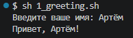
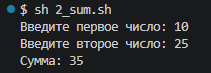
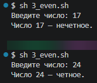
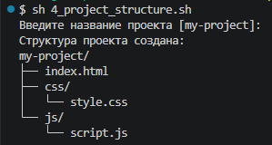
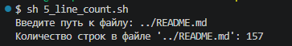
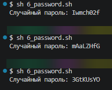
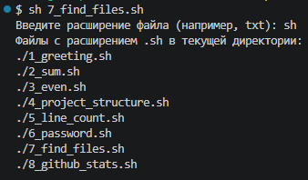
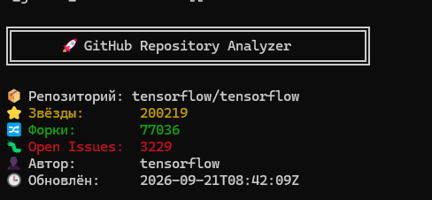

# 🖥️ Самостоятельная работа по Bash

> Практическая работа по основам **Bash-программирования**, работе с файлами, условиями, переменными, командами Linux и GitHub API.

---

## 📌 О работе

В рамках самостоятельной работы были разработаны и протестированы **8 Bash-скриптов**.

Первые семь заданий посвящены основам Bash и работе с командной строкой. Восьмое задание выполняется в **Ubuntu WSL** и использует публичный **GitHub API** для получения статистики репозиториев.

Все скрипты разрабатывались в **Visual Studio Code** и проверялись через **Git Bash** и **Ubuntu WSL**.

---

## 📂 Структура репозитория

```text
bash-practicals/
│
├── 📁 scripts/
│   ├── 1.sh
│   ├── 2.sh
│   ├── 3.sh
│   ├── 4.sh
│   ├── 5.sh
│   ├── 6.sh
│   ├── 7.sh
│   └── github-stats.sh
│
├── 📁 img/
│   ├── 1.png
│   ├── 2.png
│   ├── 3.png
│   ├── 4.png
│   ├── 5.png
│   ├── 6.png
│   ├── 7.png
│   └── 8.png
│
└── 📄 README.md
```

---

## 📑 Содержание

* [1. Приветствие пользователя](#1--приветствие-пользователя)
* [2. Калькулятор суммы](#2--калькулятор-суммы)
* [3. Проверка чётности числа](#3--проверка-чётности-числа)
* [4. Создатель структуры проекта](#4--создатель-структуры-веб-проекта)
* [5. Счётчик строк в файле](#5--счётчик-строк-в-файле)
* [6. Генератор паролей](#6--генератор-паролей)
* [7. Поиск файлов по расширению](#7--поиск-файлов-по-расширению)
* [8. Анализ GitHub-репозитория](#8--анализ-github-репозитория)
* [Используемые технологии](#-используемые-технологии)
* [Проверка скриптов](#-проверка-скриптов)
* [Итог](#-итог)

---

# 🧪 Выполненные задания

## 1. 👋 Приветствие пользователя

Первое задание посвящено работе с пользовательским вводом.

Скрипт запрашивает имя пользователя с помощью команды `read`, после чего выводит персональное приветствие.

### Пример работы

```text
Введите ваше имя: Иван
Привет, Иван!
```

### 📄 Скрипт

```text
scripts/1.sh
```

### 🖼️ Результат выполнения



---

## 2. ➕ Калькулятор суммы

Скрипт запрашивает у пользователя два числа и вычисляет их сумму.

### Пример работы

```text
Введите первое число: 15
Введите второе число: 27
Сумма: 42
```

### 📄 Скрипт

```text
scripts/2.sh
```

### 🖼️ Результат выполнения



---

## 3. 🔢 Проверка чётности числа

Скрипт определяет, является ли введённое пользователем число чётным или нечётным.

Для проверки используется остаток от деления числа на `2`.

### Пример работы

```text
Введите число: 24
Число 24 является четным.
```

### 📄 Скрипт

```text
scripts/3.sh
```

### 🖼️ Результат выполнения



---

## 4. 🌐 Создатель структуры веб-проекта

Скрипт автоматически создаёт базовую структуру файлов и папок для небольшого веб-проекта.

После запуска создаётся следующая структура:

```text
my-project/
├── index.html
├── css/
│   └── style.css
└── js/
    └── script.js
```

Таким образом, скрипт позволяет быстро подготовить основные файлы для начала разработки веб-страницы.

### 📄 Скрипт

```text
scripts/4.sh
```

### 🖼️ Результат выполнения



---

## 5. 📄 Счётчик строк в файле

Скрипт запрашивает имя или путь к файлу и определяет количество строк, содержащихся в нём.

Для подсчёта используется стандартная Unix-команда `wc`.

### Пример работы

```text
Введите имя файла: example.txt
Количество строк: 10
```

### 📄 Скрипт

```text
scripts/5.sh
```

### 🖼️ Результат выполнения



---

## 6. 🔐 Генератор паролей

Скрипт создаёт случайный пароль длиной **8 символов**.

Генерация выполняется автоматически, поэтому при каждом запуске может получаться новый пароль.

### Пример результата

```text
Сгенерированный пароль: a7Kp92Lm
```

### 📄 Скрипт

```text
scripts/6.sh
```

### 🖼️ Результат выполнения



---

## 7. 🔎 Поиск файлов по расширению

Скрипт позволяет найти файлы определённого расширения в текущей директории.

Пользователь указывает необходимое расширение, после чего скрипт выводит найденные файлы.

### Пример работы

```text
Введите расширение файла: sh

Найденные файлы:
./scripts/1.sh
./scripts/2.sh
./scripts/3.sh
```

### 📄 Скрипт

```text
scripts/7.sh
```

### 🖼️ Результат выполнения



---

# 8. 📊 Анализ GitHub-репозитория

В восьмом задании был разработан Bash-скрипт для получения статистики публичного GitHub-репозитория.

Скрипт принимает название репозитория в формате:

```text
владелец/репозиторий
```

Например:

```bash
./github-stats.sh tensorflow/tensorflow
```

Для получения данных используется публичный **GitHub API**.

### 📌 Получаемая информация

Скрипт отображает:

* 📦 название репозитория;
* ⭐ количество звёзд;
* 🔀 количество форков;
* 🐛 количество открытых Issues;
* 👤 автора репозитория;
* 📅 дату последнего обновления;
* 📊 уровень активности репозитория.

### 🎨 Цветной вывод

Для удобства восприятия статистика выводится с использованием цветов:

| Показатель      | Цвет       |
| --------------- | ---------- |
| ⭐ Звёзды        | 🟡 Жёлтый  |
| 🔀 Форки        | 🟢 Зелёный |
| 🐛 Issues > 100 | 🔴 Красный |
| 🐛 Issues ≤ 100 | 🟡 Жёлтый  |

### Пример запуска

```bash
./github-stats.sh tensorflow/tensorflow
```

### Пример вывода

```text
╔════════════════════════════════════════╗
║     🚀 GitHub Repository Analyzer      ║
╚════════════════════════════════════════╝

📦 Репозиторий: tensorflow/tensorflow
⭐ Звёзды:       ...
🔀 Форки:        ...
🐛 Open Issues:  ...
👤 Автор:        ...
📊 Активность:   ...
```

### 🛡️ Обработка ошибок

В скрипте предусмотрена проверка:

* наличия `curl`;
* наличия `jq`;
* корректности указанного репозитория;
* ошибок GitHub API;
* превышения лимитов API;
* отсутствия или некорректности полученных данных.

При возникновении ошибки пользователь получает понятное сообщение в терминале.

### 📄 Скрипт

```text
scripts/github-stats.sh
```

### 🖼️ Результат выполнения



---

# 🛠️ Используемые технологии

В процессе выполнения работы использовались:

| Технология                | Назначение                        |
| ------------------------- | --------------------------------- |
| 🐚 **Bash**               | Написание скриптов                |
| 🪟 **Git Bash**           | Запуск и тестирование скриптов    |
| 🐧 **Ubuntu WSL**         | Выполнение Linux-скрипта          |
| 💻 **Visual Studio Code** | Разработка и редактирование       |
| 🔧 **Git**                | Контроль версий                   |
| 🌐 **GitHub API**         | Получение статистики репозиториев |
| 📡 **curl**               | Отправка HTTP-запросов            |
| 🔍 **jq**                 | Обработка JSON-ответов API        |

---

# ▶️ Проверка скриптов

Скрипты из первых семи заданий проверялись в **Git Bash**.

Для запуска используется команда:

```bash
sh script.sh
```

Например:

```bash
sh 1.sh
```

или:

```bash
sh scripts/1.sh
```

GitHub-анализатор запускается с передачей репозитория в качестве аргумента:

```bash
./github-stats.sh owner/repository
```

Например:

```bash
./github-stats.sh tensorflow/tensorflow
```

---

# 📁 Расположение результатов

Все скриншоты выполнения заданий находятся в отдельной папке:

```text
img/
```

Названия файлов соответствуют номерам заданий:

```text
img/1.png
img/2.png
img/3.png
img/4.png
img/5.png
img/6.png
img/7.png
img/8.png
```

Благодаря относительным путям вида:

```markdown

```

изображения отображаются непосредственно внутри `README.md` на странице репозитория.

---

# ✅ Итог

В результате самостоятельной работы были разработаны и протестированы **8 Bash-скриптов**, охватывающих основные возможности командной оболочки:

1. 👋 Получение имени пользователя и вывод приветствия.
2. ➕ Сложение двух чисел.
3. 🔢 Проверка числа на чётность.
4. 🌐 Автоматическое создание структуры веб-проекта.
5. 📄 Подсчёт строк в файле.
6. 🔐 Генерация случайного пароля.
7. 🔎 Поиск файлов по расширению.
8. 📊 Получение статистики GitHub-репозиториев через API.

Все исходные скрипты находятся в папке `scripts/`, а результаты их выполнения представлены в папке `img/`.

---

<div align="center">

**Bash Practicals • VS Code • Git • WSL**

*Самостоятельная работа по Bash программированию*

</div>
