## Mermaid

**Mermaid** — это специализированный язык разметки и библиотек JavaScript, использующий синтаксис на основе Markdown для создания, редактирования и визуализации сложных диаграмм, блок-схем, графов и отчетов.

> 📝 **Справочное руководство:** Документ содержит описание основных возможностей, типов диаграмм и синтаксиса Mermaid.

---

### Блок схемы

#### Базовая структура 1

Горизонтальная ориентация схемы (`LR` — Left to Right).

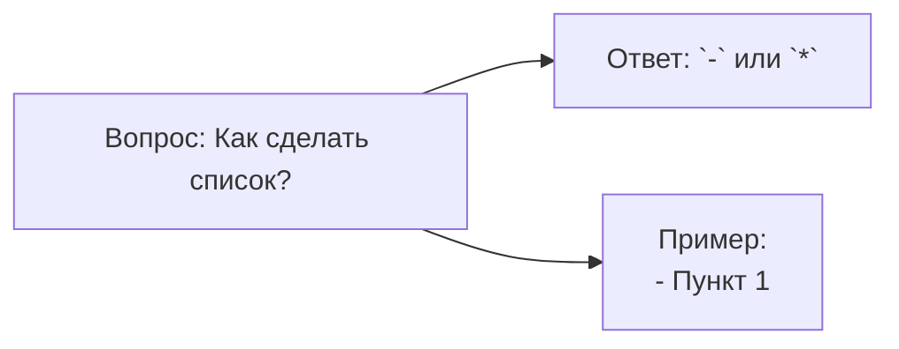

* `flowchart` — ключевое слово для создания блок-схемы;
* `LR` — направление слева направо (Left -> Right);
* `A[]`, `B[]`, `C[]` — прямоугольные узлы с текстом;
* `-->` — стрелка связи между узлами.

#### Базовая структура 2

Вертикальная ориентация схемы (`TD` или `TB` — Top Down / Top to Bottom) с условиями и ветвлением.

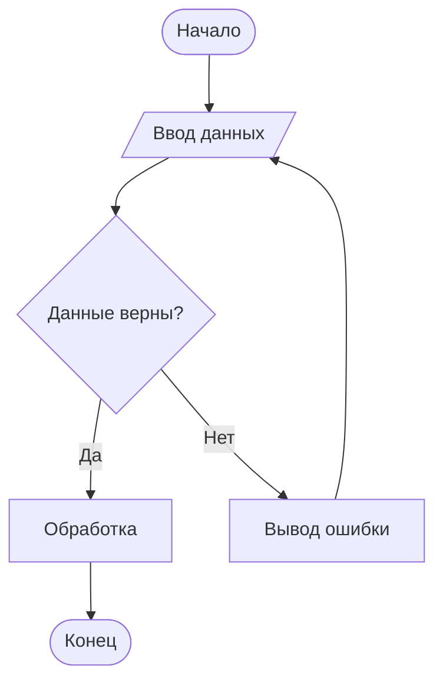

* `TD` / `TB` — направление сверху вниз;
* `([ ... ])` — узел со скруглёнными краями (стадион), часто применяется для начала/конца;
* `{ ... }` — ромб (узел принятия решений/условие);
* `[/ ... /]` — параллелограмм для ввода/вывода данных;
* `-- Текст -->` или `-- Текст` — подпись линии связи.

#### Полный синтаксис блок-схем

##### 1. Направления диаграммы
* `TD` / `TB` — сверху вниз (Top-Down);
* `BT` — снизу вверх (Bottom-Top);
* `RL` — справа налево (Right-Left);
* `LR` — слева направо (Left-Right).

##### 2. Формы узлов
| Синтаксис | Форма узла | Визуальный тип |
| :--- | :--- | :--- |
| `id[Текст]` | Прямоугольник | Стандартный шаг |
| `id(Текст)` | Скруглённый прямоугольник | Вспомогательный элемент |
| `id([Текст])` | Стадион | Начало / Конец |
| `id[[Текст]]` | Подпроцесс | Вызов функции / Модуля |
| `id[(Текст)]` | Цилиндр | База данных / Хранилище |
| `id((Текст))` | Круг | Связующий узел |
| `id>Текст]` | Асимметричный (флаг) | Сообщение / Событие |
| `id{Текст}` | Ромб | Условие / Ветвление |
| `id{{Текст}}` | Шестиугольник | Подготовка / Настройка |
| `id[/Текст/]` | Параллелограмм | Ввод / Вывод |

##### 3. Типы связей (стрелок)
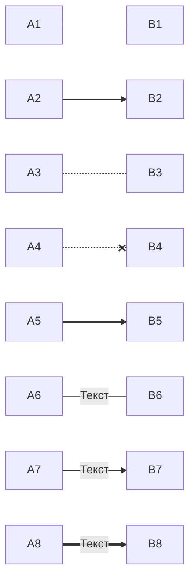

##### 4. Подграфы (Subgraphs)
Позволяют группировать узлы в логические блоки.

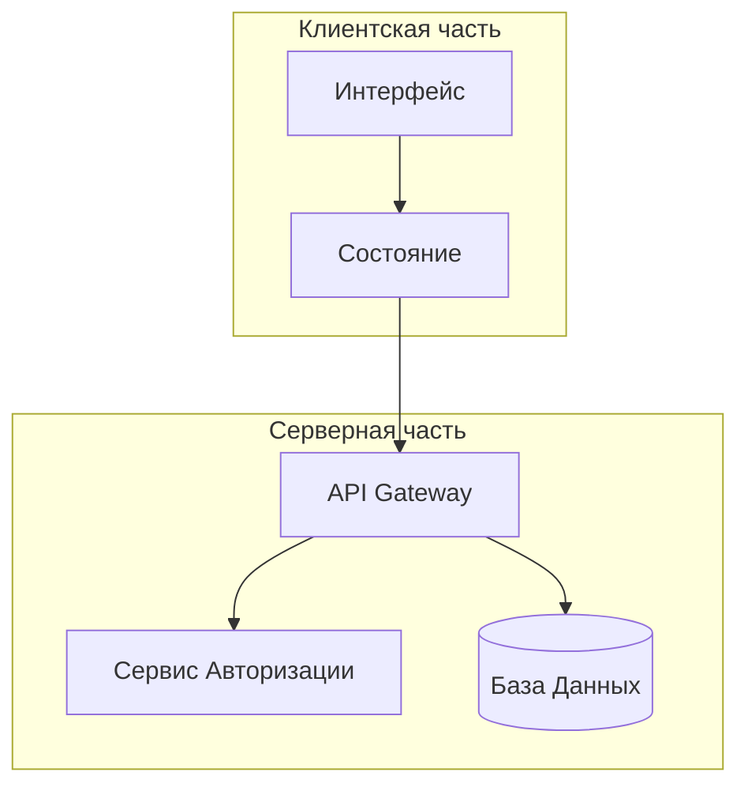

---

### Диаграмма последовательности

Диаграмма последовательности (`sequenceDiagram`) отображает взаимодействие процессов или объектов во времени.

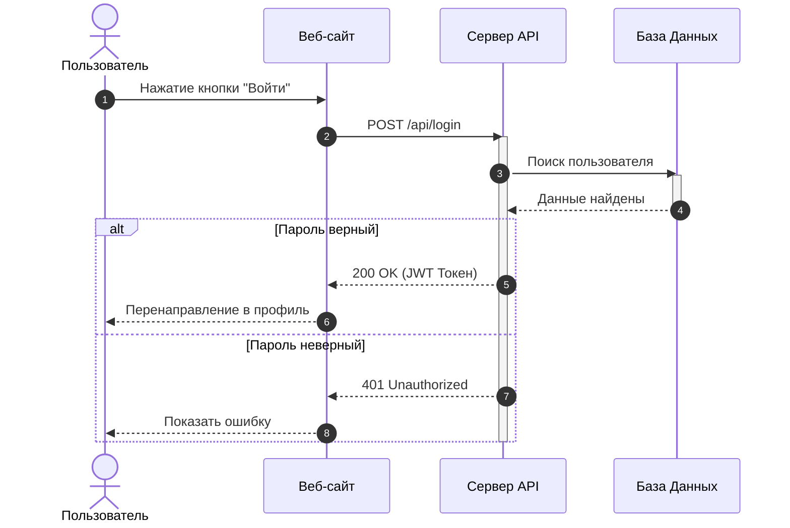

* `actor` — антропоморфная фигура (пользователь, внешняя система);
* `participant` — участник взаимодействия;
* `->>` — сплошная линия со стрелкой (синхронный запрос);
* `-->>` — пунктирная линия со стрелкой (ответ);
* `activate` / `deactivate` — подсвечивает период активности компонента;
* `alt / else / end` — условные блоки и альтернативные сценарии.

---

### Диаграмма класса

Используется для объектно-ориентированного проектирования и визуализации структуры классов, их атрибутов и методов.

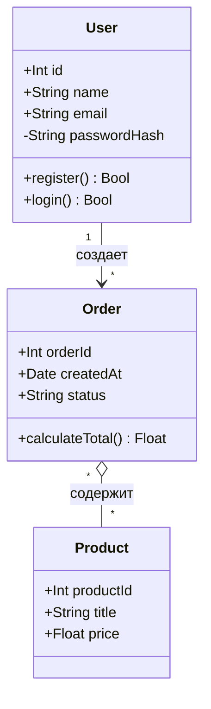

* **Модификаторы доступа:**
  * `+` Public (публичный)
  * `-` Private (приватный)
  * `#` Protected (защищенный)
  * `~` Package/Internal (внутренний)
* **Типы связей:**
  * `<|--` Наследование (Inheritance)
  * `*--` Композиция (Composition)
  * `o--` Агрегация (Aggregation)
  * `-->` Ассоциация (Association)

---

### Диаграмма Ганта

Предназначена для планирования проектов, визуализации этапов, задач и сроков их выполнения.

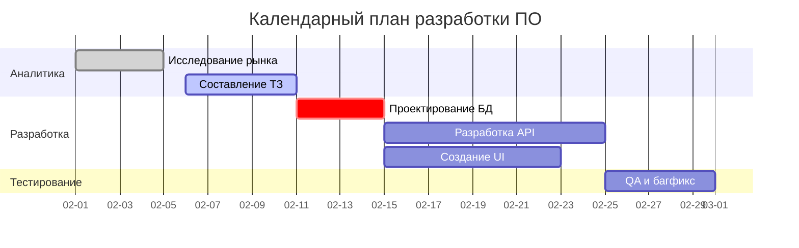

* `title` — название диаграммы;
* `dateFormat` — формат ввода дат;
* `section` — группировка задач по этапам;
* `done`, `active`, `crit` — статусы задач (завершено, в процессе, критический путь);
* `after <id>` — установка зависимостей между задачами.

---

### Граф зависимостей

Графы зависимостей удобно строить на базе `flowchart`, показывая связи между пакетами, модулями или сервисами.

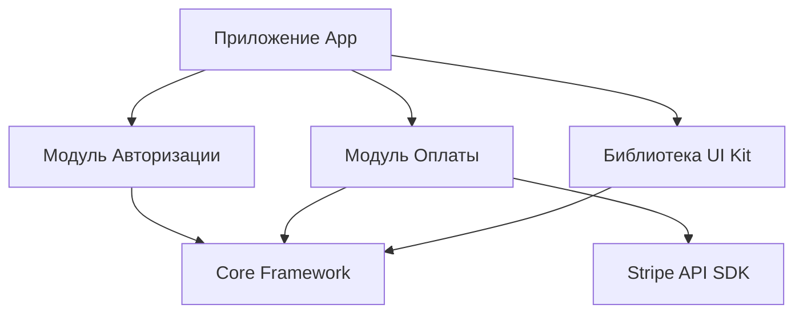

---

### Диаграмма состояний

Описывает конечный автомат (State Machine) — переход объекта из одного состояния в другое под воздействием событий.

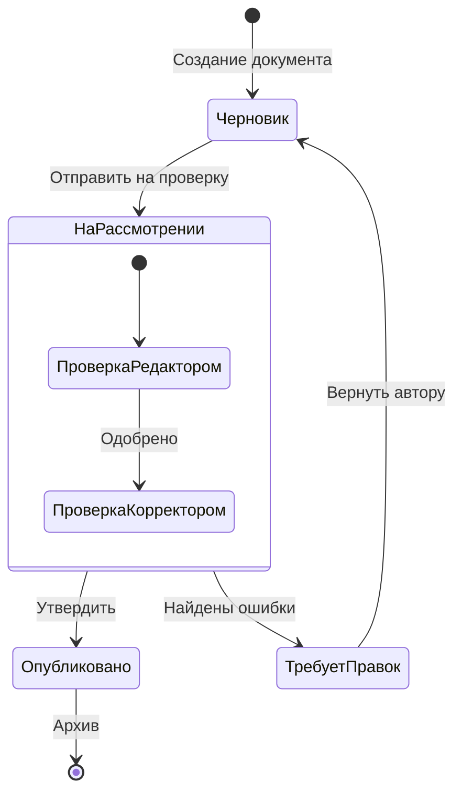

* `[*]` — начальное и конечное состояние;
* `-->` — переход из одного состояния в другое;
* `state Name { ... }` — вложенные (составные) состояния.

---

### Юзер-джайрни

Диаграмма User Journey описывает шаги пользователя при взаимодействии с продуктом и уровень его удовлетворенности на каждом этапе.

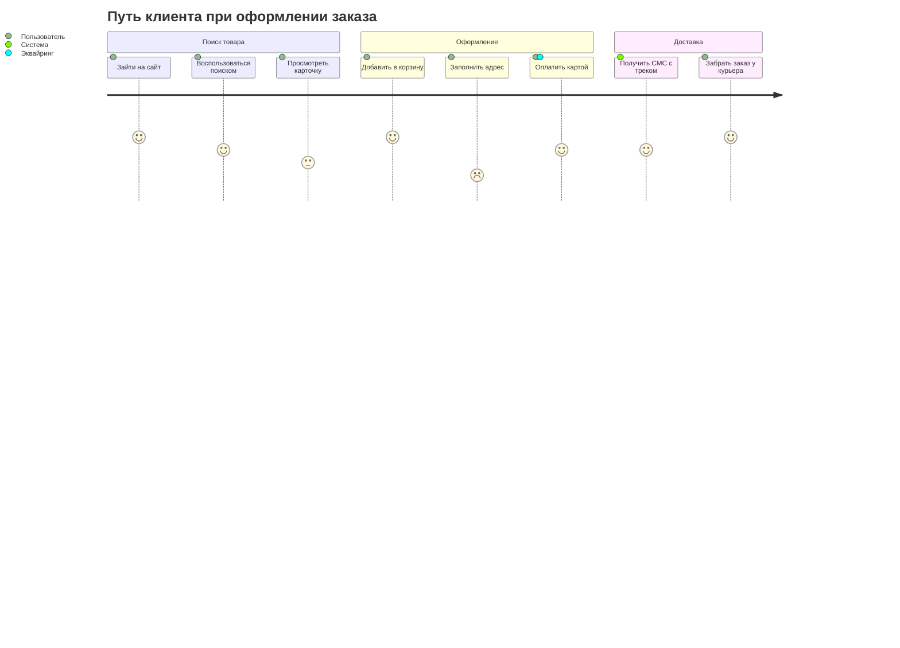

* Оценка удовлетворенности ставится по шкале от `1` до `5`;
* После двоеточия указываются участники (роли), задействованные на шаге.

---

### Кастомизация стилей

#### Классы CSS

С помощью directives `classDef` и оператора `class` можно стилизовать отдельные блоки.

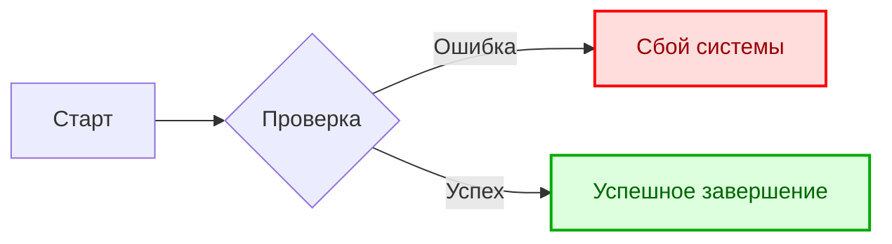

#### Интерактивность

Узлы диаграммы можно делать кликабельными, привязывая к ним ссылки или JavaScript-вызовы.

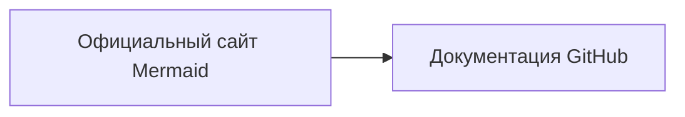

---

### Круговая диаграмма

Используется для визуализации процентного или пропорционального соотношения данных.

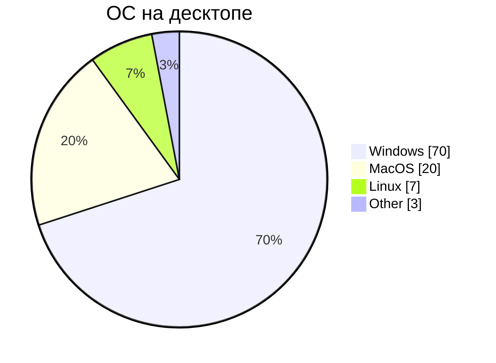

* `pie` — ключевое слово круговой диаграммы;
* `showData` — опциональный флаг для отображения точных числовых значений рядом с легендой;
* `"Ключ" : Значение` — элементы диаграммы и их доли.